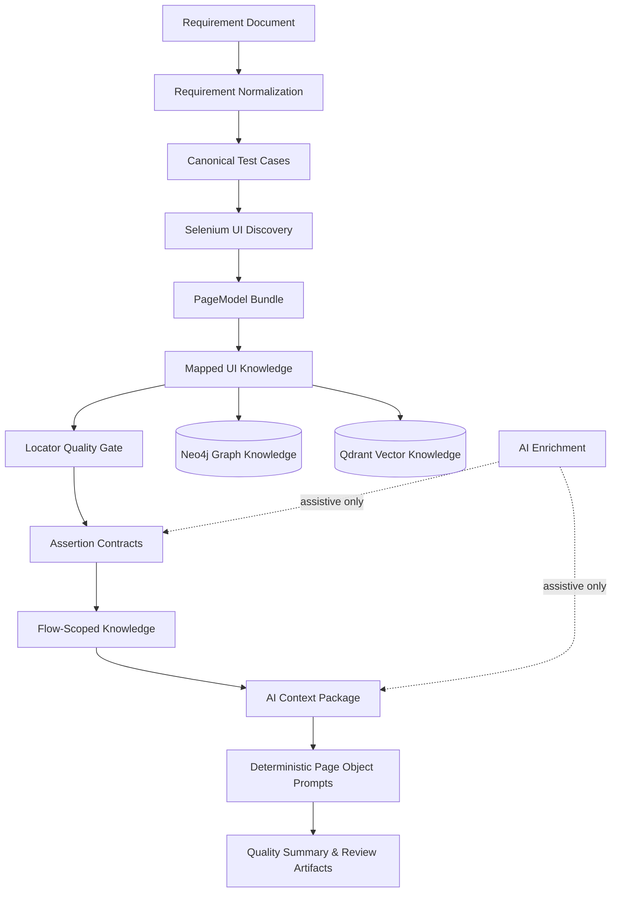

AI QA Automation Platform — Showcase
> Requirement-driven QA automation R&D project focused on traceable UI/API test design, Selenium UI discovery, locator quality, assertion contracts, and AI-assisted prompt generation.


Overview
AI QA Automation Platform is an experimental QA automation platform that explores how requirements, UI discovery, structured test knowledge, and AI-assisted enrichment can work together without turning the LLM into an uncontrolled source of truth.
The goal is not to "let AI blindly generate tests".  
The goal is to build a traceable, reviewable, quality-gated QA workflow that can support automation engineers during test design, Page Object planning, locator selection, and coverage analysis.
The core repository is currently private. This public README-only repository is intended as a portfolio and architecture showcase.
---
Why This Project Exists
Modern QA automation teams often struggle with:
unclear requirement-to-test traceability;
unstable UI locators and flaky Selenium tests;
duplicated or missing UI/API test coverage;
large prompts with irrelevant page evidence;
AI-generated code that is hard to review or validate;
weak connection between requirements, UI pages, actions, assertions, and automation artifacts.
This project explores a safer approach:
```text
Requirements
  -> Normalized test knowledge
  -> UI discovery
  -> PageModel mapping
  -> Locator quality gates
  -> Assertion contracts
  -> Scoped prompt-ready context
  -> Reviewable Page Object specifications
```
---
Core Idea
The platform treats AI as an assistive enrichment layer, not as the system of record.
AI may help with:
expected-result enrichment;
PageModel metadata enrichment;
prompt context preparation;
review-oriented specification generation.
AI does not directly generate and persist Java test code in the active workflow.
Direct Java code generation is intentionally disabled until schema validation, review flows, quality gates, and deterministic writers are stable.
---
High-Level Workflow

---
Main Capabilities
Requirement-driven test design
The platform starts from requirement documents and converts them into structured testing knowledge:
normalized requirements;
canonical test cases;
expected-result candidates;
unresolved expected results for manual review;
requirement-to-page and requirement-to-assertion traceability.
Selenium UI discovery
The discovery layer inspects a web application and extracts:
pages and routes;
visible elements;
forms and fields;
candidate actions;
page transitions;
locator candidates;
screenshot and HTML evidence.
PageModel and UI mapping
Raw discovery evidence is converted into structured UI knowledge:
`PageModel` — discovered page structure and evidence;
`MappedPage` — semantic page identity, route, actions, assertions, elements, forms;
`MappedUiKnowledge` — full mapper output with pages, transitions, graph nodes, graph edges, and vector documents.
Locator quality gates
The platform scores and filters locator evidence before it can be promoted into prompt-ready or persistence-ready knowledge.
Current deterministic checks include:
locator strategy priority;
same-origin validation;
external-origin rejection;
uniqueness evidence;
repeated-discovery stability evidence;
long/absolute XPath risk detection;
visible-text XPath risk detection;
low-confidence locator filtering.
Prompt safety
Prompt generation is scoped and quality-gated to reduce context leakage:
target page and target route checks;
scoped requirement IDs;
canonical test case inclusion;
expected value validation;
allowed locator evidence;
forbidden method constraints;
cross-route enrichment blocking;
raw WebDriver usage blocking;
weak URL assertion blocking.
Knowledge layer experiments
The platform experiments with:
Neo4j for graph-based page/action/assertion relationships;
Qdrant for vector-based UI knowledge retrieval;
route-scoped retrieval;
current-run filtering;
cache lookup for previously enriched page knowledge.
Run quality reports
Each AI-assisted run can produce reviewable artifacts such as:
prompt files;
scope traces;
expected-result resolution reports;
assertion contracts;
page enrichment reports;
quality summaries;
artifact diffs between runs.
---
Architecture Layers
```text
requirements/
  Requirement loading
  Requirement normalization
  Canonical test case generation

ui.discovery/
  Selenium crawling
  Page snapshots
  Element/form/action extraction
  Locator candidate collection

ui.mapping/
  PageModel -> MappedPage
  Locator scoring
  Page/action/assertion mapping
  Graph/vector artifact building

ai.context/
  Target-aware slicing
  Route-scoped retrieval
  Prompt-ready context assembly

ai.enrichment/
  Expected-result enrichment
  PageModel enrichment
  Cache lookup and reuse

ai.ui/
  Page Object prompt generation
  Prompt quality linting
  Scope trace writing

quality/
  Run quality summary
  Artifact diff
  Blocking issue reporting
```
---
AI Safety Boundary
This project deliberately avoids uncontrolled AI code generation.
Area	AI role	Deterministic boundary
Requirements	Assist with enrichment	Normalization and traceability remain structured
Expected results	Suggest / resolve candidates	Low-confidence results go to review
PageModel metadata	Enrich page intent and risks	Locator evidence comes from discovery
Page Object generation	Prompt preparation only	Direct Java source writing is disabled
Code quality	No authority	Quality gates and compile/review stages are required
---
Example Runtime Artifacts
The private development repository generates runtime artifacts under `target/`, for example:
```text
target/ai-run/context/
target/ai-run/enrichment/
target/ai-run/expectations/
target/ai-run/need-review/
target/ai-run/page-object-spec/
target/ai-run/quality/
target/discovery/
```
Typical files:
```text
page-object-spec/LoginPage-prompt.txt
page-object-spec/LoginPage-scope-trace.json
expectations/test-case-expected-results.json
need-review/expected-results-needs-review.json
quality/run-quality-summary.json
quality/artifact-diff.json
```
---
Current Focus
The active development focus is:
reducing irrelevant evidence leakage into prompts;
improving deterministic page identity resolution;
improving locator confidence without LLM involvement;
separating raw mapped knowledge from prompt-ready evidence;
extending the platform toward API coverage mapping;
preparing public showcase artifacts.
---
Planned API Layer
The next major direction is an API testing layer that connects requirements with backend contracts.
Planned capabilities:
OpenAPI / Swagger parsing;
endpoint model generation;
requirement-to-endpoint mapping;
API assertion contracts;
API coverage matrix;
RestAssured test specification generation;
UI/API traceability reporting.
Target workflow:
```text
Requirements
  -> UI coverage
  -> API endpoint coverage
  -> Assertion contracts
  -> RestAssured-ready test specs
  -> Coverage and quality report
```
---
Planned Performance Smoke Layer
The platform may also generate lightweight performance smoke scenarios for critical API endpoints.
Planned output:
critical endpoint list;
baseline response-time thresholds;
k6 script drafts;
CI-ready performance smoke commands;
performance quality summary.
The goal is not to replace JMeter, k6, Gatling, or enterprise load-testing tools.  
The goal is to connect requirements, API contracts, and performance smoke coverage.
---
Tech Stack
Area	Tools / Concepts
Language	Java 17
UI Automation	Selenium WebDriver, TestNG
API Testing	RestAssured, Postman, Swagger/OpenAPI
Build	Maven
Reporting	Allure, JSON quality artifacts
CI/CD	GitHub Actions
Knowledge Graph	Neo4j
Vector Retrieval	Qdrant
AI Layer	Prompt engineering, enrichment, RAG concepts
QA Concepts	POM, locator quality, assertion contracts, requirement traceability
---
Repository Status
This is a README-only public showcase repository.
The full source code is currently private because the project is still evolving and contains experimental architecture, local configuration, generated runtime artifacts, and implementation details that are not yet prepared for open-source release.
Selected artifacts can be shared on request:
architecture overview;
sample requirements;
sample PageModel output;
sample mapped UI knowledge;
sample prompt file;
sample scope trace;
sample run quality summary.
---
Roadmap
Short term
[ ] Public sample architecture diagram
[ ] Sample requirement package
[ ] Sample PageModel JSON
[ ] Sample mapped UI knowledge JSON
[ ] Sample prompt and scope trace
[ ] Sample quality summary
Mid term
[ ] API layer prototype
[ ] Requirement-to-endpoint coverage matrix
[ ] RestAssured test specification generator
[ ] Prompt-safe evidence contract
[ ] Mapper quality report
Long term
[ ] Public sanitized demo repository
[ ] HTML quality dashboard
[ ] API + UI traceability report
[ ] Performance smoke generation
[ ] Human review workflow for generated artifacts
---
Author
Petro Krasytskyi  
QA Automation Engineer / SDET focused on Java UI/API automation and AI-assisted QA workflows.
GitHub: github.com/PKrasytskyi
LinkedIn: Petro Krasytskyi
Location: Cologne, Germany
---
Notes
This project is a personal R&D and portfolio initiative.  
It is intended to demonstrate QA automation architecture, requirement-driven testing, AI-assisted test design, and safe prompt-based automation workflows.
