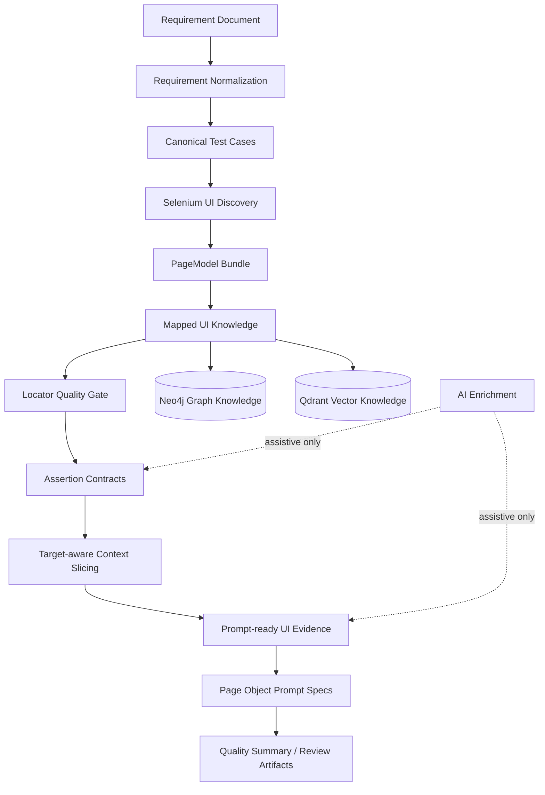

# AI-assisted QA Automation Platform Showcase

> A portfolio showcase of an experimental Java-based QA automation platform that connects requirements, UI discovery, locator quality gates, assertion contracts, and AI-assisted prompt preparation.


---

## What is this?

This repository is a **README-only public showcase** for a private R&D project.

The goal of the platform is to explore how QA automation can become more traceable and safer when requirements, UI discovery, API contracts, locator quality, assertions, and AI-assisted enrichment are handled as structured knowledge instead of one large prompt.

The full source code is currently private. Selected architecture notes and sanitized artifacts can be shared on request.

---

## Why I built it

Modern QA automation often suffers from:

- weak requirement-to-test traceability;
- unstable UI locators and flaky Selenium tests;
- unclear links between requirements, UI pages, actions, API endpoints, and assertions;
- large prompts with irrelevant page evidence;
- AI-generated code that is difficult to review, validate, or safely maintain.

This project explores a safer workflow:

```text
Requirements
  -> Normalized test knowledge
  -> UI discovery
  -> PageModel mapping
  -> Locator quality gates
  -> Assertion contracts
  -> Scoped prompt-ready context
  -> Reviewable Page Object specifications
  -> Quality summary and review artifacts
```

---

## Core principle

The platform does **not** treat the LLM as the source of truth.

AI is used only as an assistive layer for:

- expected-result enrichment;
- PageModel metadata enrichment;
- prompt context preparation;
- reviewable Page Object specification drafts.

Direct Java test code generation is intentionally disabled until schemas, validation gates, review flows, and deterministic writers are stable.

---

## High-level workflow



---

## Main capabilities

### Requirement-driven test design

The platform starts from requirement documents and converts them into structured test knowledge:

- normalized requirements;
- canonical test cases;
- expected-result candidates;
- unresolved expected results for manual review;
- requirement-to-page and requirement-to-assertion traceability.

### Selenium UI discovery

The discovery layer collects UI evidence from the application:

- pages and routes;
- visible elements;
- forms and fields;
- candidate actions;
- page transitions;
- locator candidates;
- screenshot and HTML evidence.

### PageModel mapping

Raw discovery evidence is converted into structured UI knowledge:

- `PageModel` — discovered page structure and evidence;
- `MappedPage` — semantic page identity, route, actions, assertions, elements, and forms;
- `MappedUiKnowledge` — pages, transitions, graph nodes, graph edges, and vector documents.

### Locator quality gates

Locator evidence is scored and filtered before it can be promoted into prompt-ready or persistence-ready knowledge.

Current deterministic checks include:

- locator strategy priority;
- same-origin validation;
- external-origin rejection;
- uniqueness evidence;
- repeated-discovery stability evidence;
- long or absolute XPath risk detection;
- visible-text XPath risk detection;
- low-confidence locator filtering.

### Prompt safety

Prompt generation is scoped and quality-gated to reduce irrelevant context leakage:

- target page and route checks;
- scoped requirement IDs;
- canonical test case inclusion;
- expected value validation;
- allowed locator evidence;
- forbidden method constraints;
- cross-route enrichment blocking;
- raw WebDriver usage blocking;
- weak URL assertion blocking.

### Knowledge layer experiments

The platform experiments with:

- Neo4j for graph-based page, action, assertion, and transition relationships;
- Qdrant for vector-based UI knowledge retrieval;
- route-scoped retrieval;
- current-run filtering;
- cache lookup for previously enriched page knowledge.

---

## AI safety boundary

| Area | AI role | Deterministic boundary |
|---|---|---|
| Requirements | Assist with enrichment | Normalization and traceability stay structured |
| Expected results | Suggest or resolve candidates | Low-confidence results go to review |
| PageModel metadata | Enrich page intent and risks | Locator evidence comes from discovery |
| Page Object generation | Prompt/spec preparation only | Direct Java source writing is disabled |
| Code quality | No authority | Quality gates, compile checks, and review stages are required |

---

## Example runtime artifacts

The private development repository generates artifacts such as:

```text
target/ai-run/page-object-spec/LoginPage-prompt.txt
target/ai-run/page-object-spec/LoginPage-scope-trace.json
target/ai-run/expectations/test-case-expected-results.json
target/ai-run/need-review/expected-results-needs-review.json
target/ai-run/quality/run-quality-summary.json
target/ai-run/quality/artifact-diff.json
target/discovery/
```

These artifacts are designed to make AI-assisted test design reviewable instead of opaque.

---

## Current development focus

- Reducing irrelevant evidence leakage into prompts.
- Improving deterministic page identity resolution.
- Improving locator confidence without LLM involvement.
- Separating raw mapped knowledge from prompt-ready evidence.
- Preparing public sanitized artifacts.
- Extending the platform toward API coverage mapping.

---

## Planned API layer

The next major direction is an API testing layer that connects requirements with backend contracts.

Planned capabilities:

- OpenAPI / Swagger parsing;
- endpoint model generation;
- requirement-to-endpoint mapping;
- API assertion contracts;
- API coverage matrix;
- RestAssured test specification generation;
- UI/API traceability reporting.

Target workflow:

```text
Requirements
  -> UI coverage
  -> API endpoint coverage
  -> Assertion contracts
  -> RestAssured-ready test specs
  -> Coverage and quality report
```

---

## Planned performance smoke layer

The platform may later generate lightweight performance smoke scenarios for critical API endpoints.

Planned output:

- critical endpoint list;
- baseline response-time thresholds;
- k6 script drafts;
- CI-ready performance smoke commands;
- performance quality summary.

The goal is not to replace JMeter, k6, Gatling, or enterprise load-testing tools.  
The goal is to connect requirements, API contracts, and performance smoke coverage.

---

## Tech stack

| Area | Tools / Concepts |
|---|---|
| Language | Java 17 |
| UI automation | Selenium WebDriver, TestNG |
| API testing | RestAssured, Postman, Swagger/OpenAPI |
| Build | Maven |
| Reporting | Allure, JSON quality artifacts |
| CI/CD | GitHub Actions |
| Knowledge graph | Neo4j |
| Vector retrieval | Qdrant |
| AI layer | Prompt engineering, enrichment, RAG concepts |
| QA concepts | POM, locator quality, assertion contracts, requirement traceability |

---

## Repository status

This is a **public showcase repository**, not the full implementation repository.

The source code is currently private because the project is still evolving and contains experimental architecture, local configuration, generated artifacts, and implementation details that are not yet prepared for open-source release.

Available on request:

- architecture overview;
- sample requirements;
- sample PageModel output;
- sample mapped UI knowledge;
- sample Page Object prompt;
- sample scope trace;
- sample run quality summary.

---

## Roadmap

### Short term

- [ ] Add public architecture diagram
- [ ] Add sample requirement package
- [ ] Add sample PageModel JSON
- [ ] Add sample mapped UI knowledge JSON
- [ ] Add sample prompt and scope trace
- [ ] Add sample quality summary

### Mid term

- [ ] API layer prototype
- [ ] Requirement-to-endpoint coverage matrix
- [ ] RestAssured test specification generator
- [ ] Prompt-safe evidence contract
- [ ] Mapper quality report

### Long term

- [ ] Public sanitized demo repository
- [ ] HTML quality dashboard
- [ ] API + UI traceability report
- [ ] Performance smoke generation
- [ ] Human review workflow for generated artifacts

---

## Author

**Petro Krasytskyi**  
QA Automation Engineer / SDET focused on Java UI/API automation and AI-assisted QA workflows.

- GitHub: [PKrasytskyi](https://github.com/PKrasytskyi)
- LinkedIn: [Petro Krasytskyi](https://www.linkedin.com/in/petro-krasytskyi-54a7b918b/)
- Location: Cologne, Germany

---

## Note

This project is a personal R&D and portfolio initiative.  
It is intended to demonstrate QA automation architecture, requirement-driven testing, AI-assisted test design, and safe prompt-based automation workflows.
